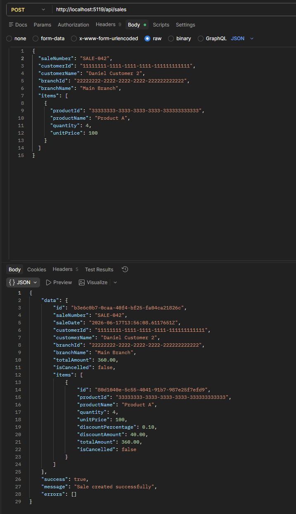
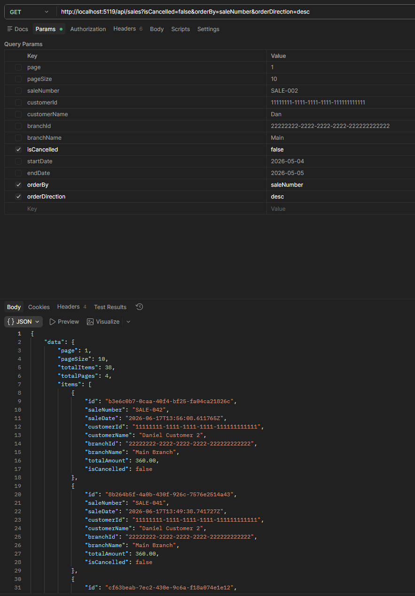
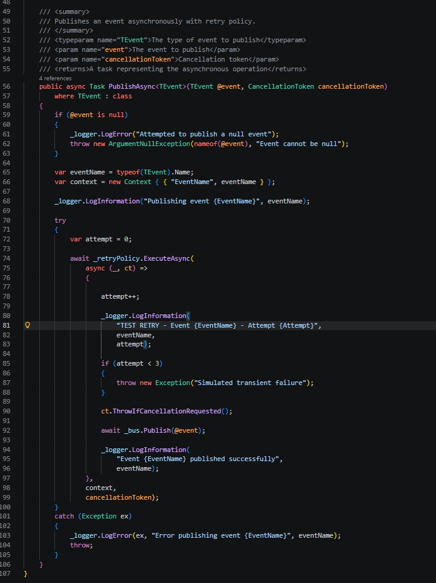
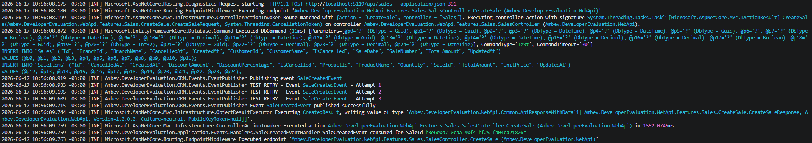
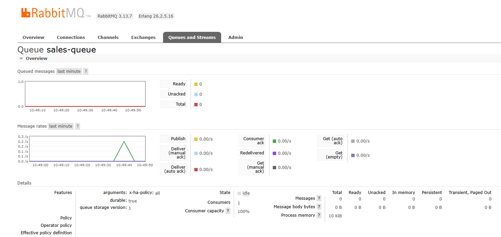
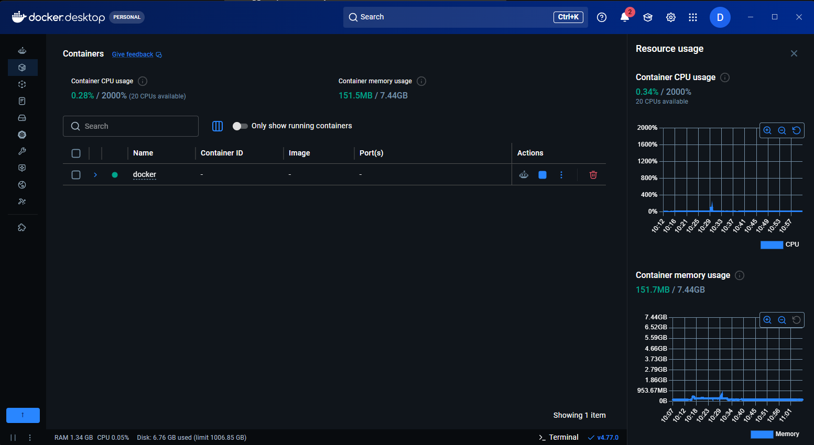
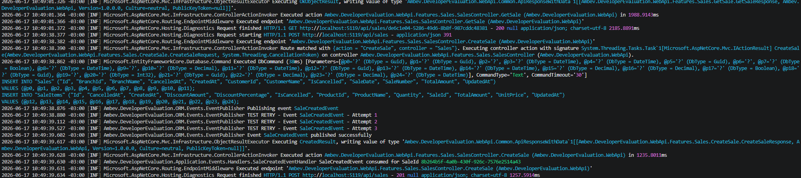

# Ambev Developer Evaluation - Sales API


## 📌 Overview

This project implements a Sales API following Clean Architecture principles using .NET 8, Entity Framework Core, and PostgreSQL.

The API supports full sales lifecycle management, including creation, retrieval, update, cancellation, and listing of sales, with business rules applied at the domain level.

The solution was evolved after technical feedback to include event publishing abstractions, retry policies with Polly, and a more decoupled architecture prepared for future asynchronous messaging integration.

---
# 🚀 Post-Interview Technical Enhancement – Event-Driven Architecture

After completing the original challenge, I decided to further evolve the solution by implementing an asynchronous messaging layer using RabbitMQ and Rebus.

The goal was to demonstrate how the application could evolve from a traditional request/response architecture to an event-driven architecture capable of supporting future integrations, scalability scenarios, and distributed processing.

This enhancement includes:

* RabbitMQ integration
* Rebus message bus
* Domain event publishing
* Asynchronous event consumption
* Retry policies using Polly
* Structured event logging
* Consumer handlers for domain events
* Dockerized RabbitMQ environment

The implementation was designed following Clean Architecture principles while keeping the Application layer decoupled from infrastructure concerns.

---

## 🚀 Technologies

* .NET 8
* ASP.NET Core Web API
* Entity Framework Core
* PostgreSQL
* MediatR
* AutoMapper
* Polly
* RabbitMQ
* Rebus
* Serilog
* xUnit
* Bogus
* NSubstitute

---

## ⚙️ How to run the project

### 1. Clone the repository

```bash
git clone https://github.com/danielbgusmao/rabbitmq-event-driven-architecture.git
cd feature-testeOmnia
```

---

### 2. Configure the database

Update the connection string in:

```text
src/Ambev.DeveloperEvaluation.WebApi/appsettings.json
```

```json
"ConnectionStrings": {
  "DefaultConnection": "Host=localhost;Port=5432;Database=omnia_db;Username=postgres;Password=postgres123"
}
```

---

### 3. Apply migrations

```bash
dotnet ef database update -p src/Ambev.DeveloperEvaluation.ORM -s src/Ambev.DeveloperEvaluation.WebApi
```

---

### 4. Run the API

```bash
dotnet run --project src/Ambev.DeveloperEvaluation.WebApi
```

---

### 5. Access Swagger

```text
http://localhost:<port>/swagger
```

---

## 📦 Endpoints

### ➕ Create Sale

```http
POST /api/sales
```

---

### 🔍 Get Sale by ID

```http
GET /api/sales/{id}
```

---

### ✏️ Update Sale

```http
PATCH /api/sales/{id}
```

---

### ❌ Cancel Sale

```http
PATCH /api/sales/{id}/cancel
```

---

### 📄 List Sales (Pagination & Filters)

```http
GET /api/sales
```

#### Query Parameters

* page (default: 1)
* pageSize (default: 10, max: 100)
* saleNumber
* customerId
* customerName
* branchId
* branchName
* isCancelled
* startDate
* endDate
* orderBy (saleDate, totalAmount, saleNumber, customerName, branchName)
* orderDirection (asc, desc)

---

### 🔎 Example - List Sales

```http
GET /api/sales?page=1&pageSize=10&customerName=Daniel&orderBy=totalAmount&orderDirection=desc
```

---

## 🧪 Example Request

### Create Sale

```json
{
  "saleNumber": "SALE-001",
  "customerId": "11111111-1111-1111-1111-111111111111",
  "customerName": "Daniel Customer",
  "branchId": "22222222-2222-2222-2222-222222222222",
  "branchName": "Main Branch",
  "items": [
    {
      "productId": "33333333-3333-3333-3333-333333333333",
      "productName": "Product A",
      "quantity": 4,
      "unitPrice": 100
    }
  ]
}
```

---

## 📬 Postman Collection

Manual tests were performed using Postman to validate all endpoints and business rules.

You can import the Postman collection to test all endpoints easily:

👉 [Download Postman Collection](docs/Localhost.postman_collection.json)

After importing, update the base URL if needed and run the requests.

---

## 📊 Business Rules

### Discount Tiers

| Quantity | Discount |
| -------- | -------- |
| 1–3      | 0%       |
| 4–9      | 10%      |
| 10–20    | 20%      |

---

### Restrictions

* ❌ Maximum 20 items per product
* ❌ No discount for less than 4 items
* ❌ Cancelled sales cannot be updated

---

## 🧠 Architecture

The project follows Clean Architecture principles with clear separation of concerns:

* **Domain** → Business rules and entities
* **Application** → Commands, Queries, Handlers, Events and abstractions
* **ORM** → Entity Framework Core mappings and infrastructure implementations
* **WebApi** → Controllers and HTTP endpoints
* **IoC** → Dependency injection and module registration

The solution evolved after technical feedback to reduce coupling between layers by introducing abstractions for persistence and event publishing.

Additionally, the application now supports asynchronous event-driven communication using RabbitMQ and Rebus.

---

## ✅ What was implemented

* Full CRUD for Sales
* Pagination, filtering and sorting
* Domain-driven business rules
* Clean Architecture
* PostgreSQL with EF Core migrations
* Postman collection for manual testing
* Unit tests for domain rules and handlers
* Event publishing abstraction
* Retry policy for event publishing using Polly
* RabbitMQ integration using Rebus
* Asynchronous event publishing and consumption
* Decoupled Application layer from ORM layer using abstractions
* Structured logging with Serilog

---

## 🔥 Additional Features

* Domain-driven design (DDD)
* Automatic discount calculation
* Validation at domain level
* Pagination and filtering for listing sales
* Resilient event publishing with Polly retry policies
* Asynchronous communication using RabbitMQ and Rebus
* Event-driven architecture implementation

### Published Events

* SaleCreatedEvent
* SaleModifiedEvent
* SaleCancelledEvent

### Event Consumers

* SaleCreatedEventHandler
* SaleModifiedEventHandler
* SaleCancelledEventHandler

### Event Flow

```text id="0ykqvi"
CreateSale → EventPublisher → RabbitMQ → Consumer Handler
UpdateSale → EventPublisher → RabbitMQ → Consumer Handler
CancelSale → EventPublisher → RabbitMQ → Consumer Handler
```

---

## 📡 Event-Driven Architecture

The application publishes and consumes domain events asynchronously using RabbitMQ and Rebus.

Implemented flow:

```text id="g4c0mg"
Controller
 ↓
Mediator.Send(command)
 ↓
Handler
 ↓
Domain
 ↓
Repository
 ↓
Database
 ↓
EventPublisher
 ↓
Rebus
 ↓
RabbitMQ
 ↓
Queue
 ↓
Consumer Handler
```

Implemented consumers:

* SaleCreatedEventHandler
* SaleModifiedEventHandler
* SaleCancelledEventHandler

The architecture supports future scalability and distributed communication patterns while keeping the main API flow decoupled and resilient.

---

## 📷 Implementation Evidence

### Sale Creation Request



Demonstrates successful sale creation through the API endpoint.

---

### Sale Query with Pagination and Filters



Demonstrates retrieval of persisted sales using pagination, filtering and sorting.

---

### Event Publishing and Retry Policy



Shows the event publishing workflow and retry strategy implementation using Polly.

---

### Event Consumption



Shows asynchronous consumption of the SaleCreatedEvent through Rebus.

---

### RabbitMQ Queue



Queue monitoring through RabbitMQ Management UI.

---

### Docker Environment



RabbitMQ running inside a Docker container.

---

### End-to-End Flow Validation



Evidence of successful persistence, event publication and asynchronous processing.


---

## 🧪 Tests

The solution includes unit tests for:

* Domain entities
* Business rules
* Discount calculations
* Quantity restrictions
* Handlers
* Event publishing flow
* Retry policy behavior

Tools used:

* xUnit
* Bogus
* NSubstitute
* EF Core InMemory

Run tests:

```bash
dotnet test .\Ambev.DeveloperEvaluation.sln
```

---

## 🚧 Future Improvements

* Implement item cancellation endpoint
* Add integration tests for API endpoints and database persistence
* Add authentication and authorization with JWT Bearer
* Add Docker Compose orchestration
* Improve automated test coverage
* Add distributed tracing and monitoring
* Add dead-letter queue strategy for failed events
* Add observability dashboards for asynchronous flows

---

## 💡 Notes

* External Identities pattern is used (Customer, Product, Branch)
* Business rules are enforced in the domain layer
* The API uses MediatR to decouple application logic
* Retry policies are implemented using Polly
* RabbitMQ and Rebus are used for asynchronous event-driven communication
* Structured logging was implemented to improve observability
* The architecture was designed to support future scalability and distributed systems patterns

## 🎯 Why This Enhancement Was Added

Although asynchronous messaging was not a mandatory requirement of the original challenge, this enhancement was implemented to demonstrate how the solution could be extended in a real-world enterprise environment.

By introducing RabbitMQ and Rebus, the application is now prepared for:

* Service decoupling
* Distributed processing
* Event-driven integrations
* Improved scalability
* Resilience through retry policies
* Future microservices adoption

This implementation was developed as a proactive technical improvement after the interview process.
